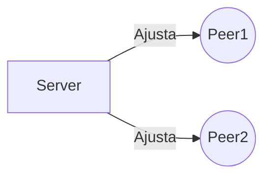

# Trabalho prático 02 - Sistemas Distribuídos
Esse trabalho possui como objetivo a aplicação dos conteúdos vistos em aula da parte de sincronização.

# Arquivos
Para o desenvolvimento do trabalho será necessário dois módulos para que funcione a aplicação do algoritmo. Um arquivo é responsável pelo lado servidor e o outro para o lado do cliente. O servidor periodicamente irá fazer o ajuste dos relógios dos demais pares para que garanta a sincronização dos mesmos.

# Arquitetura
